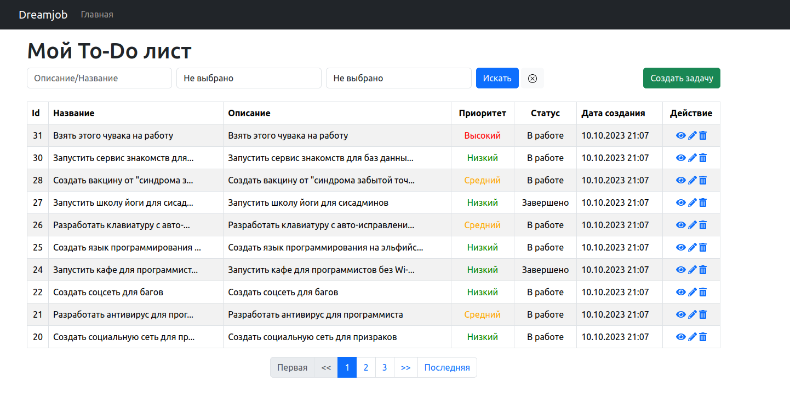

    
    <h1 align="center">Test Project for Dream Job</h1>
     

This is a small text TodoList prepared by Stanislav Albertovich Borzykh for a php backend developer vacancy in the Dream Job project
The minimum requirement by this project template that your Web server supports PHP 7.4.

INSTALLATION
------------
Just copy the project from the repository
~~~
git clone https://github.com/MasterHuaster/dream-job.git
~~~
Install the necessary packages
~~~
composer install
~~~
Change configuration files for database access
**Please note that you need to specify a test database too!!!**
~~~
config/db.php
config/test_db.php
~~~
Install migrations for the database, and for the test database
~~~
php yii migrate && cd ./tests/bin && php yii migrate/up && cd ../..
~~~
Install demo data (optional)
~~~
php yii fixture/load Task
~~~
LAUNCH
------------
Let's make sure everything works by running the command
~~~
vendor/bin/codecept run unit
~~~
Let's launch the built-in server to use the application
~~~
php yii serve
~~~
By default, the application will be available by URL
~~~
http://localhost:8080
~~~

FILES I'VE BEEN WORKING ON
-------------------
      composer.json
      config/db.php
      config/test_db.php
      config/web.php
      controllers/TasksController.php
      migrations/m231010_160751_create_tasks_table.php
      models/Task.php
      tests/_data/task.php
      tests/functional/TasksControllerCest.php
      tests/unit/fixtures/TaskFixture.php
      tests/unit/models/TaskTest.php
      views/layouts/main.php
      views/site/index.php
      views/tasks/_form.php
      views/tasks/create.php
      views/tasks/index.php
      views/tasks/update.php
      views/tasks/view.php
      web/css/site.css
      web/svg/x-circle.svg
